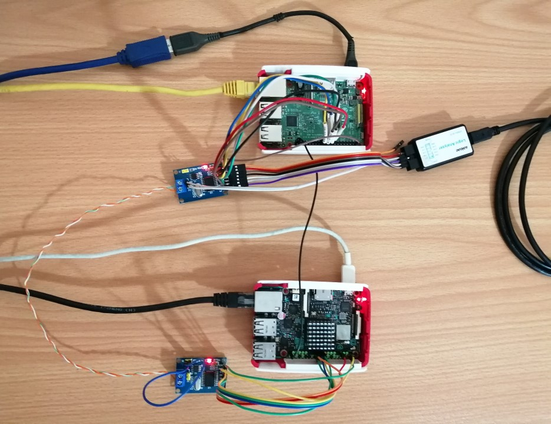
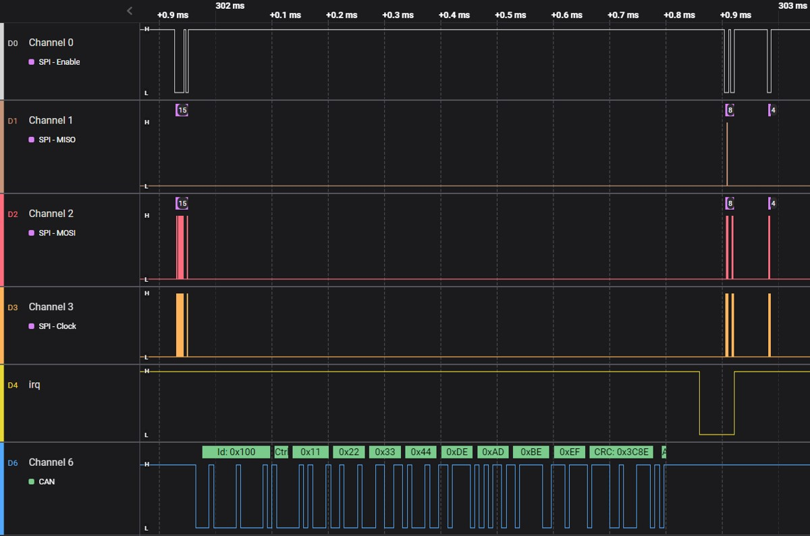

# Introduction 
This layer helps you to add `mcp2515` module into _ASUS-Tinker_ board.

# Getting started
1. Clone required layers:
```bash
git clone git://git.yoctoproject.org/poky -b dunfell
cd poky/
git clone https://github.com/openembedded/meta-openembedded.git -b dunfell
git clone https://github.com/ArashEM/meta-canexp.git -b dunfell
cd ../
```
2. Export template configuraiton path and initialize build envrionment
```bash
export TEMPLATECONF=${TEMPLATECONF:-meta-canexp/conf}
source poky/oe-init-build-env tinker-board/
```
3. Start build process
```bash
bitbake core-image-full-cmdline
```
# Connections
This is top view of _AUSU-Tinker_ 40 pin header.
| `mcp2515` | `Tinker pinout` | `Number` | `Number` | `Tinker pinout` | `mcp2515` |
| --------- | --------------- | -------- | -------- | --------------- | --------- |
|  **3v3**  | **3v3**         | 1        |   2      | **5v0**         | **5v0**   |
| -         |  -              | 3        |   4      |  -              |   -       |
| -         |  -              | 5        |   6      |  **GND**        | **GND**   |
| **INT**   |  **GP0C1**      | 7        |   8      |  -              |   -       |
| -         |  -              | 9        |   10     |  -              |   -       |
| -         |  -              | 11       |   12     |  -              |   -       |
| -         |  -              | 13       |   14     |  -              |   -       |
| -         |  -              | 15       |   16     |  -              |   -       |
| -         |  -              | 17       |   18     |  -              |   -       |
| **SI**    |  **SPI2TX**     | 19       |   20     |  -              |   -       |
| **SO**    |  **SPI2RX**     | 21       |   22     |  -              |   -       |
| **SCK**   |  **SPI2CLK**    | 23       |   24     |  **SPI2CSN0**   |   **CS**  |
| -         |  -              | 25       |   26     |  -              |   -       |
| -         |  -              | 27       |   28     |  -              |   -       |
| -         |  -              | 29       |   30     |  -              |   -       |
| -         |  -              | 31       |   32     |  -              |   -       |
| -         |  -              | 33       |   34     |  -              |   -       |
| -         |  -              | 35       |   36     |  -              |   -       |
| -         |  -              | 37       |   38     |  -              |   -       |
| -         |  -              | 39       |   40     |  -              |   -       |

# View
Here is what it looks like :-)   
Connectig `rasppberypi` and `asus-tinker` via **CAN** network.


Here is what happend over `SPI` and `CAN` when I issued `cansend can0 100#11223344deadbeef` from `rasppbery`


# Notes
Please note that:
1. `dunfell` branch of `meta-rockchip` use Linux version **5.4.205** by default. But for using `isotp` and `socketcand` you need at least Linux version **5.10.0** or later. I handled it by adding `PREFERRED_PROVIDER_virtual/kernel ?= "linux-yocto-dev"` to `conf/local.conf.sample`.
2. You need to provide **5v0** supply for CAN transceiver (`tja1050`) because it won't work with **3v3** supply from _ASUS-Tinker_. (this [link](https://github.com/tolgakarakurt/CANBus-MCP2515-Raspi) is very good instruction about fixning this issue)
3. As you can see in [0001-add-can-interface.patch](recipes-core/init-ifupdown/init-ifupdown/0001-add-can-interface.patch), I'm using **125Kbps** bitrate
4. In order to change `SPI` interface (e.g. using `SPI0`) or interrupt pin, you need to change [0001-add-mcp2515-interface.patch](recipes-kernel/linux/linux-yocto-dev/0001-add-mcp2515-interface.patch) file.
5. Becarefule about interrupt pin! It **MUST** be and unclaimed GPIO pin. you can check ` /sys/kernel/debug/pinctrl/pinctrl-rockchip-pinctrl/pinmux-pins` to see status of each pin.

# More
1. This [presentation](https://wiki.automotivelinux.org/_media/agl-distro/agl2017-socketcan-print.pdf) explain SocketCAN in very good detail
2. You can use [SavvyCAN](https://www.savvycan.com/) with [socketcand](https://github.com/linux-can/socketcand). This way you have full access to `can0` interface of _ASUS-Tinker_ over ethernet and great GUI of SavvyCAN
3. The book [The Car Hacker's Handbook](https://www.oreilly.com/library/view/the-car-hackers/9781457198847/) provide valuable information about CAN and car internel network
